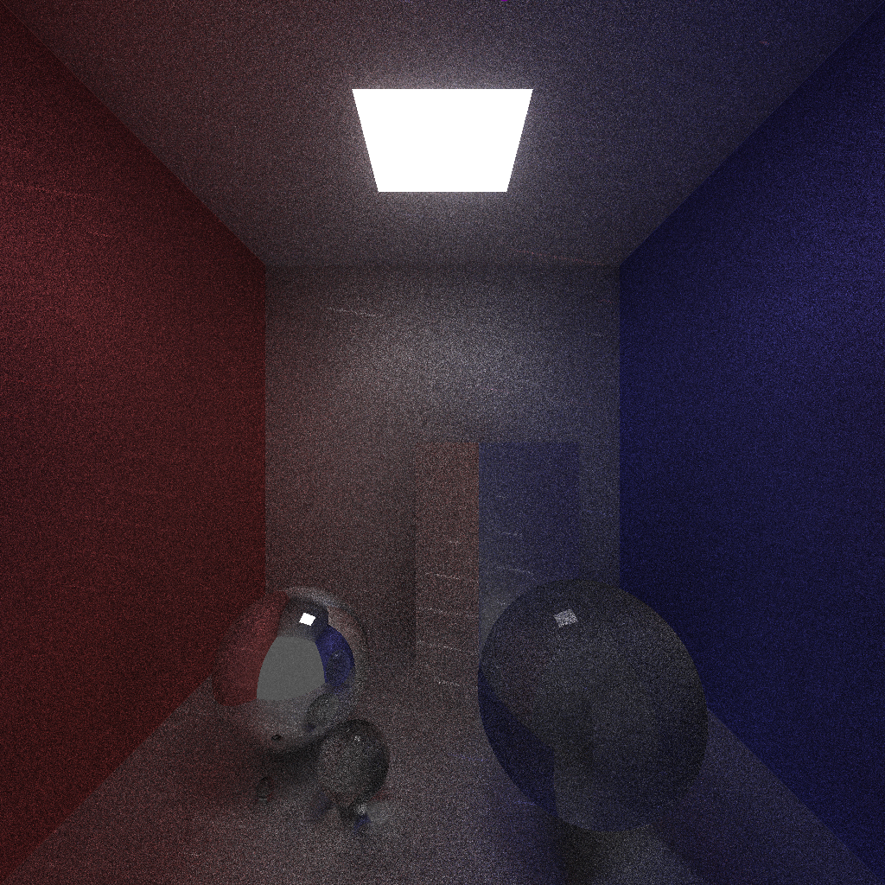
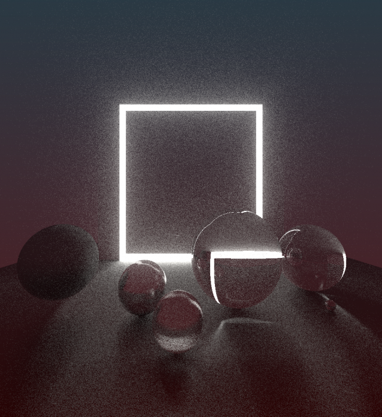

GPU powered raytracer made with OpenGL with help of my library [modular-glsl](https://github.com/kcpikkt/moduar-glsl).
It simulates basic light-material interactions like reflection and refraction with configurable roughness and refraction coefficient as well as emissive materials. 

Note that only gpu that I am in possesion of is Intel HD Graphics integrated graphics card so - although this raytracer is capable of rendering prettier, less noisy images - especially in this draft, unoptimized stage, it would choke my laptop.
